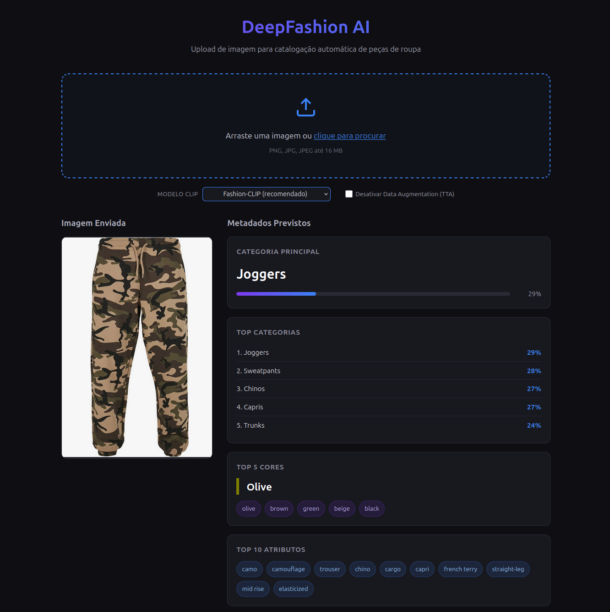

# DeepFashion AI — Catalogação Inteligente

Interface Web para upload e catalogação automática de peças de roupa via CLIP / Fashion-CLIP e Ollama (LLaVA).



## Project Tree

```
.
├── app.py
├── Backlog_PIA(1).pdf
├── deepfashion
│   ├── Anno_coarse
│   │   ├── list_attr_cloth.txt
│   │   ├── list_attr_colors.txt
│   │   ├── list_attr_img.txt
│   │   ├── list_bbox.txt
│   │   ├── list_category_cloth.txt
│   │   └── list_category_img.txt
│   ├── Anno_fine
│   │   ├── list_attr_cloth.txt
│   │   ├── list_attr_img.txt
│   │   ├── list_category_cloth.txt
│   │   ├── test_attr.txt
│   │   ├── test_bbox.txt
│   │   ├── test_cate.txt
│   │   ├── test_landmarks.txt
│   │   ├── test.txt
│   │   ├── train_attr.txt
│   │   ├── train_bbox.txt
│   │   ├── train_cate.txt
│   │   ├── train_landmarks.txt
│   │   ├── train.txt
│   │   ├── val_attr.txt
│   │   ├── val_bbox.txt
│   │   ├── val_cate.txt
│   │   ├── val_landmarks.txt
│   │   └── val.txt
│   ├── Eval
│   |    └── list_eval_partition.txt
│   └── img
├── models/                    # Checkpoints CNN (gerados após treino)
├── Modelfile
├── README.md
├── requirements.txt
├── scripts
│   ├── eval_cnn.py            # Avaliação do modelo CNN
│   ├── setup_dataset.py
│   ├── train_cnn.py           # Treino da CNN (categoria)
│   └── train_multitask.py     # Treino da CNN Multi-Task (cat + attrs)
├── src
│   ├── cnn_dataset.py         # Dataset PyTorch para CNN (categoria)
│   ├── cnn_multitask_dataset.py  # Dataset Multi-Task (cat + attrs)
│   ├── cnn_multitask_model.py    # Modelo ResNet50 + 2 cabeças
│   ├── cnn_multitask_predictor.py  # Inferência Multi-Task
│   ├── cnn_multitask_trainer.py    # Treino Multi-Task
│   ├── cnn_predictor.py       # Inferência CNN (schema JSON compatível)
│   ├── cnn_trainer.py         # Lógica de treino transfer-learning
│   ├── dataset_manager.py
│   ├── ollama_predictor.py
│   └── predictor.py
├── static
│   ├── css
│   │   └── style.css
│   └── js
│       └── main.js
├── templates
│   └── index.html
└── ui.png
```

## Estrutura

| Ficheiro / Diretório | Descrição |
|----------------------|-----------|
| `app.py` | Aplicação Flask (UI + API REST) |
| `src/predictor.py` | Pipeline CLIP/Fashion-CLIP com TTA e output JSON |
| `src/ollama_predictor.py` | Wrapper para LLaVA via Ollama (schema compatível) |
| `src/cnn_dataset.py` | Dataset PyTorch para DeepFashion (50 categorias) |
| `src/cnn_trainer.py` | Treino de ResNet50/EfficientNet com transfer learning |
| `src/cnn_predictor.py` | Inferência CNN com output JSON no schema do CLIP |
| `src/dataset_manager.py` | Validação, deduplicação e split do dataset DeepFashion |
| `scripts/setup_dataset.py` | Download automático do dataset DeepFashion (gdown) |
| `scripts/train_cnn.py` | Entrypoint para treinar a CNN |
| `scripts/eval_cnn.py` | Avaliação e benchmark (Top-1, Top-5, gráficos) |
| `Modelfile` | Definição do modelo Ollama customizado (base: `llava`) |
| `deepfashion/` | Dataset DeepFashion (anotações coarse + fine + eval + imagens) |
| `models/` | Checkpoints da CNN (gerados após treino) |
| `static/`, `templates/` | Assets da interface web |

## Setup

### 1. Dependências Python

```bash
pip install -r requirements.txt
```

### 2. Dataset DeepFashion

```bash
python scripts/setup_dataset.py
```

Ou manualmente: colocar o dataset em `deepfashion/` com a estrutura esperada (`Anno_coarse/`, `Anno_fine/`, `Eval/`, `img/`).

### 3. CNN (opcional, para benchmark tradicional)

**Opção A: CNN para categoria (simples)**

```bash
# Fase 1: feature-extraction (3 épocas) + Fase 2: fine-tuning
python scripts/train_cnn.py --model resnet50 --epochs 20 --batch 64 --lr 1e-3
```

**Opção B: CNN Multi-Task (categoria + atributos)**

```bash
# Treina ResNet50 com 2 cabeças: categoria (50 classes) + atributos (554 úteis)
python scripts/train_multitask.py --epochs 20 --batch 64 --lr 1e-3 --cat-weight 1.0 --attr-weight 0.5
```

Avaliar no test set:

```bash
python scripts/eval_cnn.py --checkpoint models/resnet50_best.pth --model resnet50
```

### 4. Ollama (opcional, para LLaVA local)

1. Instalar [Ollama](https://ollama.com/)
2. Criar o modelo customizado:

```bash
ollama create deepfashion-llava -f Modelfile
```

## Run

```bash
python3 app.py
```

A aplicação fica disponível em `http://localhost:5000`.

## Modelos Suportados

A interface permite alternar dinamicamente entre os seguintes modelos:

| Modelo | Descrição |
|--------|-----------|
| `patrickjohncyh/fashion-clip` | **Padrão** — Fashion-CLIP otimizado para vestuário |
| `openai/clip-vit-base-patch32` | CLIP ViT-B/32 (OpenAI) |
| `openai/clip-vit-base-patch16` | CLIP ViT-B/16 (OpenAI) |
| `laion/CLIP-ViT-B-32-laion2B-s34B-b79K` | CLIP ViT-B/32 (LAION-2B) |
| `openai/clip-vit-large-patch14` | CLIP ViT-L/14 (OpenAI — mais pesado) |
| `ollama/llava` | LLaVA finetuned (deepfashion-llava) via Ollama |
| `cnn/resnet50` | ResNet50 treinada em DeepFashion (apenas categoria) |

## API Endpoints

- `POST /predict` — Upload de imagem + predição (multipart/form-data)
- `POST /api/predict` — Endpoint API puro (mesma funcionalidade)
- `GET /uploads/<filename>` — Servir imagens carregadas

Parâmetros opcionais no `POST`:
- `model` — nome do modelo a usar (ver tabela acima)
- `no_tta` — `"true"` para desativar Data Augmentation

## TODO
- Arranjar alternativas para o ollama (AI gateway Vercel / Ollama Cloud?)
- Treinar e avaliar a CNN ResNet50 no test set completo para benchmark vs CLIP
- Gerar slides e relatório final (T4.1–T4.3)
